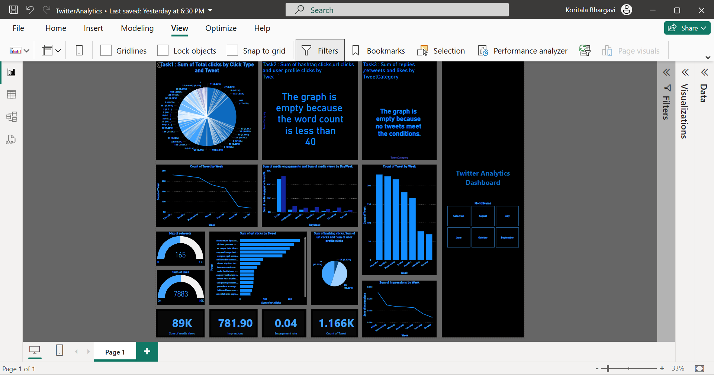

# 📊 Twitter Analytics Dashboard

This project analyzes Twitter data using Power BI, aiming to uncover insights about tweet engagement, media performance, and user interactions. The dashboard provides a comprehensive overview through interactive visuals and advanced DAX-based logic.

---

## 🚀 Project Objectives

- Analyze tweet-level engagement metrics like likes, retweets, replies, impressions, and clicks.
- Understand how users interact with tweets through media, hashtags, URLs, and profile views.
- Segment tweets based on content type (links, hashtags, media, etc.).
- Create conditional visuals based on specific tweet characteristics and time filters.
- Enable dynamic messaging for graphs when data doesn’t meet specified conditions.

---

## 🛠️ Tools Used

- **Power BI Desktop**
- **DAX (Data Analysis Expressions)**
- **Twitter Engagement Dataset**

---

## ✅ Tasks Performed

### 📌 KPI Cards
1. **Sum of Media Views**
2. **Overall Impressions on the Post**
3. **Engagement Rate**
4. **Count of Tweets Engaged**

### 📈 Gauges
5. **Sum of Likes**
6. **Max of Retweets**

### 📊 Bar & Column Charts
7. **Sum of URL Clicks by Tweet** (Clustered Bar Chart)
8. **Sum of Replies, Retweets, and Likes by Tweet Category** (Clustered Column Chart)
9. **Sum of Hashtag Clicks, URL Clicks, and User Profile Clicks by Tweet** (Clustered Bar Chart)
10. **Sum of Total Clicks by Click Type and Tweet**

### 📉 Line Charts
11. **Sum of Impressions by Week**
12. **Count of Tweets by Week** (Line Chart and Bar Chart)

### 📋 Pie Chart
13. **Distribution of Hashtag Clicks, URL Clicks, and User Profile Clicks**

### 📦 Grouped Comparison
14. **Sum of Media Engagements and Media Views by Week** (Clustered Bar Chart)

---

## 🧠 Advanced Logic-Based Visuals

### 📊 Conditional Chart: Replies, Retweets, and Likes

This visual appears **only if tweets satisfy all of the following conditions**:
- **Media Engagements > Median value**
- **Tweet length > 20 characters**
- **Media Views is an even number**
- **Tweet does not contain the letter 's'**
- **Tweet Date is an odd number**
- **Posted between 7 AM–11 AM or 3 PM–5 PM IST**
- **Tweet posted between June and August 2020**

If **no tweets meet these criteria**, the visual is replaced with a message like:
> _"The graph is empty because no tweets meet the conditions."_  
> _"The graph is empty because the word count is less than 40."_

These messages are displayed using **Card visuals** controlled by DAX logic.

---

## 🧩 Filters and Interactivity

- **Month Selector**: June, July, August, etc.
- Dynamic text displays based on tweet conditions
- Visual-level filters based on measures like `ShowTweetInGraph = 1`

---

## 📍 Key Insights

- Media engagement alone doesn't guarantee higher tweet interactions.
- Hashtags and URLs contribute significantly to user engagement.
- Peak engagement times vary by day and tweet characteristics.
- Stringent tweet conditions can result in empty visuals, highlighting the rarity of such posts.

---

## 🧠 Learnings

- Built complex DAX logic for conditional filtering and display
- Implemented dynamic visuals that respond to real-time data context
- Used Power BI slicers and card messages to enhance user storytelling
- Explored tweet performance trends based on time and content type

---

## 📁 Screenshot

 <!-- Replace with actual image path in repo -->

---

> Designed and developed by **Koritala Bhargavi**
